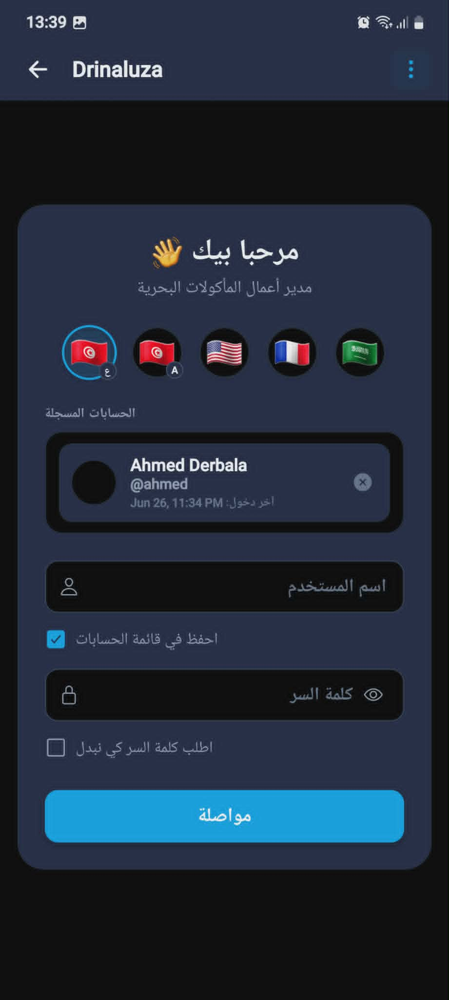
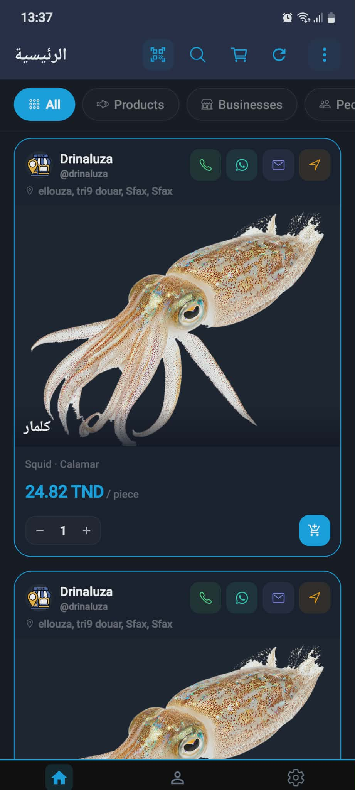
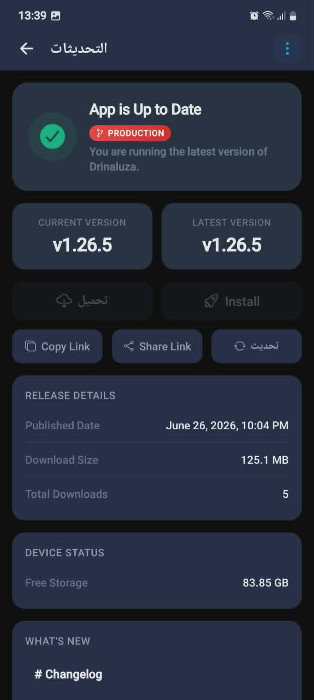

# 🛒 Drinaluza

**Drinaluza** is a powerful, mobile-first marketplace application designed to empower small businesses and provide a seamless shopping experience for customers. Built on a modern React Native & Expo stack, it bridges the gap between local businesses and their community.

[](https://drive.google.com/drive/folders/1euN1ogdssvbiq4wJdxYQBYqMXWbwIpBm?usp=drive_link)
[](https://drinaluza.netlify.app/)
[](https://drinaluza.vercel.app/)

---

## 🎬 App Demo

<p align="center">
  
</p>

*~45 second walkthrough of the Drinaluza marketplace experience on web.*

---

## 📱 Screenshots

<!-- SCREENSHOTS_START -->
<p align="center">
  
  
  
</p>
<!-- SCREENSHOTS_END -->

---

## 🚀 Features

### 🛍️ For Customers
*   **Dynamic Feed**: Discover new products and stay updated on local businesses.
*   **Business Directory**: Browse and view detailed, engaging business profiles.
*   **Order Tracking**: Seamlessly monitor purchase history and live order status.
*   **Profile Hub**: A comprehensive dashboard to manage personal information and settings.

### 🏪 For Business Owners
*   **Business Command Center**: A dedicated dashboard for multi-business operations.
*   **Product Management**: Deeply integrated, fluid tools to add, edit, and organize inventory with rich details.
*   **Real-time Analytics**: Visualize live sales data and track business growth.
*   **Intelligent Inventory**: Keep track of product status, low-stock warnings, and lifecycle operations.

---

## 🛠 Tech Stack

*   **Framework**: [Expo SDK](https://expo.dev/)
*   **Core**: React Native, React 
*   **Language**: TypeScript
*   **Navigation**: Expo Router (File-based routing)
*   **Networking**: Axios Custom Client
*   **Storage**: `@react-native-async-storage/async-storage`, `expo-secure-store`
*   **UI/UX**: `react-native-gesture-handler`, `expo-linear-gradient`, `react-native-svg`

---

## 🏁 Getting Started

### Prerequisites

*   Node.js LTS
*   npm
*   Expo CLI (or use `npx expo`)

### Installation

1.  **Clone the repository**
    ```bash
    git clone https://github.com/ahmed-derbala/drinaluza-expo.git
    cd drinaluza-expo
    ```

2.  **Install dependencies**
    You can use the built-in helper script for a complete initial setup:
    ```bash
    npm run first-time:local
    ```
    Or manually install standard dependencies:
    ```bash
    npm install
    ```

3.  **Run the application**
    
    Start the development server:
    ```bash
    npm run dev
    # or
    npm run start
    ```

    *   Press `a` for Android emulator
    *   Press `i` for iOS simulator
    *   Press `w` for Web environment

---

## sample data
```
sample data to use for testing
users:
 - user_1:
  - slug: ahmed
  - password: 123
  - role: business_owner
- user_2:
  - slug: abir
  - password: 123
  - role: customer


```

## 📂 Project Architecture

Drinaluza follows a clean, highly modular **feature-based architecture** to enforce separation of concerns and maintainability.

```text
src/
├── app/                 # Expo Router file-based route definitions
├── config/              # Environment configurations & layout constants
├── core/                # Core utilities, API clients, and React contexts
└── features/            # Feature modules (UI, API, Interfaces)
    ├── auth/            # Authentication workflows
    ├── business/        # Business administration & sales
    ├── businesses/      # Public business directories
    ├── common/          # Shared atomic components (Header, Toast, etc.)
    ├── dashboard/       # Unified dashboard and profile switching
    ├── feed/            # Activity feeds & algorithmic sorting
    ├── products/        # Product browsing & creation
    ├── profile/         # User profile management
    └── search/          # Global search components
```

---

## 📜 Available Scripts

| Command | Description |
|---|---|
| `npm run dev` | Starts the Expo development server with a clean cache. |
| `npm run start` | Standard Expo start command. |
| `npm run android` | Run on connected Android device/emulator. |
| `npm run ios` | Run on iOS simulator. |
| `npm run web` | Run as a responsive Web Application. |
| `npm run clean` | Deep clean of `node_modules`, `.expo` cache, and fresh reinstall. |
| `npm run build` | Local production build generator for Android APK/AAB. |
| `npm run format` | Enforce code style with Prettier. |

---

## ⚙️ Environment Configuration

### Gradle Settings (`~/.gradle/gradle.properties`)
For optimal Android build performance
```
docs/gradle.properties
```

### Android Environment (`~/.zshrc` or `~/.bashrc`)
Ensure the Android SDK is correctly linked in your terminal profile:
```bash
# === ANDROID SDK PATHS ===
export ANDROID_HOME=$HOME/Android/sdk
export PATH=$PATH:$ANDROID_HOME/emulator
export PATH=$PATH:$ANDROID_HOME/platform-tools
export PATH=$PATH:$ANDROID_HOME/cmdline-tools/latest/bin

# === ANDROID NDK PATHS ===
# Change the version number below to match your actual installed NDK folder
export ANDROID_NDK_HOME=$ANDROID_HOME/ndk
export PATH=$PATH:$ANDROID_NDK_HOME
```

---

## ✍️ Author

**Ahmed Derbala**
